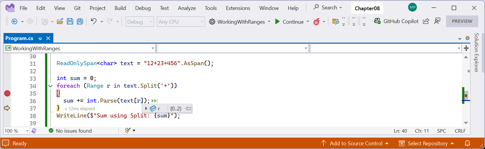

# Working with spans, indexes, and ranges

One of Microsoft’s goals with .NET Core 2.1 was to improve performance and resource usage. A key .NET feature that enables this is the `Span<T>` type.

## Using memory efficiently using spans

When manipulating arrays, you will often create new copies or subsets of existing ones so that you can process just the subset. This is not efficient because duplicate objects must be created in memory.
If you need to work with a subset of an array, use a span because it is like a window into the original array. This is more efficient in terms of memory usage and improves performance. Spans only work with arrays, not collections, because the memory must be contiguous.
Before we look at spans in more detail, we need to understand some related objects: indexes and ranges.

## Identifying positions with the Index type

C# 8 introduced two features for identifying an item’s index position within an array and a range of items using two indexes.

You learned in the previous section that objects in a list can be accessed by passing an integer into their indexer, as shown in the following code:
```cs
int index = 3;
Person p = people[index]; // Fourth person in array.
char letter = name[index]; // Fourth letter in name.
```

The `Index` value type is a more formal way of identifying a position, and supports counting from the end, as shown in the following code:
```cs
// Two ways to define the same index, 3 in from the start.
Index i1 = new(value: 3); // Counts from the start
Index i2 = 3; // Using implicit int conversion operator.

// Two ways to define the same index, 5 in from the end.
Index i3 = new(value: 5, fromEnd: true);
Index i4 = ^5; // Using the caret ^ operator.
```

## Identifying ranges with the Range type

The `Range` value type uses `Index` values to indicate the start and end of its range, using its constructor, C# syntax, or its static methods, as shown in the following code:
```cs
Range r1 = new(start: new Index(3), end: new Index(7));
Range r2 = new(start: 3, end: 7); // Using implicit int conversion.
Range r3 = 3..7; // Using C# 8.0 or later syntax.
Range r4 = Range.StartAt(3); // From index 3 to last index.
Range r5 = 3..; // From index 3 to last index.
Range r6 = Range.EndAt(3); // From index 0 to index 3.
Range r7 = ..3; // From index 0 to index 3.
```

Extension methods have been added to `string` values (which internally use an array of `char`), `int` arrays, and spans to make ranges easier to work with. These extension methods accept a range as a parameter and return a `Span<T>`. This makes them very memory-efficient.

> **Warning!** The range operator `..` (introduced with C# 8) and the spread element `..` (introduced with C# 12) look identical. Be careful to differentiate them when reading code. The range operator should always appear next to an integer, either before, after, or both. The spread element should always appear before a named variable that is enumerable.

## Using indexes, ranges, and spans

Let’s explore using indexes and ranges to return spans:
1.	Use your preferred code editor to add a new **Console App** / `console` project named `WorkingWithRanges` to the `Chapter08` solution.
2.	In `Program.cs`, delete the existing statements and then add statements to compare using the `string` type’s `Substring` method with ranges to extract parts of someone’s name, as shown in the following code:
```cs
string name = "Samantha Jones";

// Getting the lengths of the first and last names.
int lengthOfFirst = name.IndexOf(' ');
int lengthOfLast = name.Length - lengthOfFirst - 1;

// Using Substring.
string firstName = name.Substring(
  startIndex: 0,
  length: lengthOfFirst);

string lastName = name.Substring(
  startIndex: name.Length - lengthOfLast,
  length: lengthOfLast);

WriteLine($"First: {firstName}, Last: {lastName}");

// Using spans.
ReadOnlySpan<char> nameAsSpan = name.AsSpan();
ReadOnlySpan<char> firstNameSpan = nameAsSpan[0..lengthOfFirst];
ReadOnlySpan<char> lastNameSpan = nameAsSpan[^lengthOfLast..];
WriteLine($"First: {firstNameSpan}, Last: {lastNameSpan}");
```

3.	Run the code and view the result, as shown in the following output:
```
First: Samantha, Last: Jones
First: Samantha, Last: Jones
```

## Using spans for efficient text handling

One of the common problems with working with text is that copies of string values are often allocated in memory during processing. It would be more efficient to reuse the original values when possible.

Spans enable this by creating data structures that point to the original parts of a string.

For example, consider a string value containing integers separated by addition symbols that need to be summed up.

With .NET 9 and later, we can now create a span over the string value, and then use ranges to efficiently divide the integer values and pass them to the `int.Parse` method, as shown in the following code:
```cs
ReadOnlySpan<char> text = "12+23+456".AsSpan();

int sum = 0;

foreach (Range r in text.Split('+'))
{
  sum += int.Parse(text[r]);
}

WriteLine($"Sum using Split: {sum}");
```

If you set a breakpoint in the loop, then note the range object named `r` is first `[0..2]`, as shown in *Figure 8.6*, then `{3..5}`, and finally `{6..9}`:


*Figure 8.6: A span and range used to split a string efficiently*

The range values efficiently define windows into the original string without allocating new memory resources.
