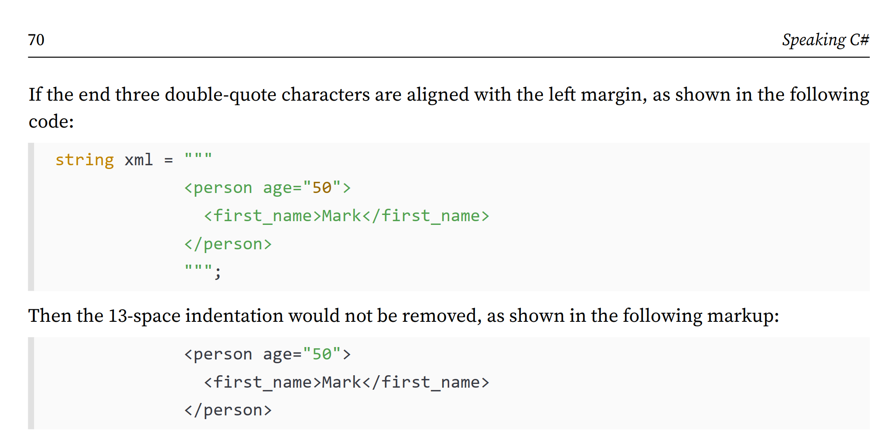
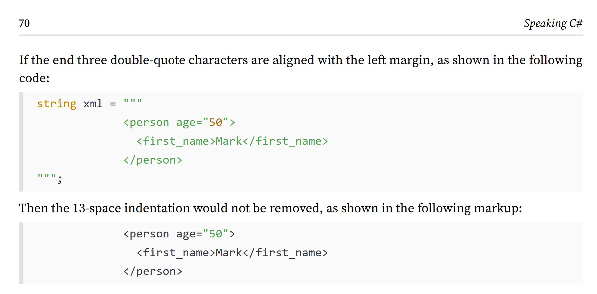

**Errata** (8 items)

If you find any mistakes, then please [raise an issue in this repository](https://github.com/markjprice/cs14net10/issues) or email me at markjprice (at) gmail.com.

> **Warning!** Avoid copying and pasting links that break over multiple lines and include hyphens or dashes because your PDF reader might remove a hyphen thinking that it being helpful but break the link! Just click on the links and they will work. Or carefully check that your PDF reader has not removed a hyphen after pasting into your web browser address bar. [See an example of this issue here](https://github.com/markjprice/cs13net9/issues/77).

- [Page 70 - Raw string literals](#page-70---raw-string-literals)
- [Page 71 - Raw string literals](#page-71---raw-string-literals)
- [Page 84 - Storing dynamic types](#page-84---storing-dynamic-types)
- [Page 103 - Getting key input from the user](#page-103---getting-key-input-from-the-user)
- [Page 521 - Managing the Northwind sample database with SQLiteStudio, Page 628 - Creating the Northwind database](#page-521---managing-the-northwind-sample-database-with-sqlitestudio-page-628---creating-the-northwind-database)
- [Page 677 - Using shared layouts with Blazor static SSR pages](#page-677---using-shared-layouts-with-blazor-static-ssr-pages)
- [Page 710 - Abstracting a service for a Blazor component](#page-710---abstracting-a-service-for-a-blazor-component)
- [Appendix B - Setting Up Your Development Environment](#appendix-b---setting-up-your-development-environment)
  - [Page 833 - Creating the Northwind sample database locally](#page-833---creating-the-northwind-sample-database-locally)

# Page 70 - Raw string literals

> Thanks to [Paul Marangoni](https://github.com/pmarangoni) for raising [this issue on November 19, 2025](https://github.com/markjprice/cs14net10/issues/1).

In the book, the following example is wrong:



It should be:



# Page 71 - Raw string literals

> Thanks to [mushobeti](https://github.com/mushobeti) for raising [this issue on November 29, 2025](https://github.com/markjprice/cs14net10/issues/2).

The following code example mistakenly indents the last three-quotes by one space:
```cs
string json = $$"""
{
  "first_name": "{{person.FirstName}}",
  "age": {{person.Age}},
  "calculation": "{{ 1 + 2 }}"
}
 """;
```

This causes the compiler to give `Error CS8999: Line does not start with the same whitespace as the closing line of the raw string literal.`

To fix this error, delete the extra space at the start of the last statement, as shown in the following code:
```cs
string json = $$"""
{
  "first_name": "{{person.FirstName}}",
  "age": {{person.Age}},
  "calculation": "{{ 1 + 2 }}"
}
""";
```

This code example was correct in earlier editions so must have been accidently introduced during the editing process. I apologize for missing it.

# Page 84 - Storing dynamic types

> Thanks to [iheartdotnet](https://github.com/iheartdotnet) for raising [this issue on August 2, 2025](https://github.com/markjprice/cs13net9/issues/61) and to [Chris Alberty](https://github.com/calberty) for noticing that I had missed fixing it in the 10th edition.

In the last paragraph of this section, I wrote, "Dynamic types are most useful when interoperating with non-.NET systems. For example, you might need to work with a class library written in F#, Python, or some JavaScript. You might also need to interop with technologies like the Component Object Model (COM), for example, when automating Excel or Word."

I included F# in the list of languages after giving the example of `dynamic` being useful when interoperating with non-.NET systems. This accidently implies that F# is not a .NET language when it is. In the next edition, I will change "non-.NET systems" to "other .NET languages and non-.NET systems".

# Page 103 - Getting key input from the user

> Thanks to [mushobeti](https://github.com/mushobeti) for raising [this issue on November 30, 2025](https://github.com/markjprice/cs14net10/issues/3).

In Steps 2 and 4, the output of the `Modifiers` should be `None` instead of `0`. To output the integer value of the `Modifiers` enum, we would use `arg2: (int)key.Modifiers`.

# Page 521 - Managing the Northwind sample database with SQLiteStudio, Page 628 - Creating the Northwind database

> Thanks to [Amar Jamal](https://github.com/amarjamal) for raising [this issue on November 4, 2025](https://github.com/markjprice/cs13net9/issues/80).

On page 521, in Step 6, I wrote, "You will see the 10 tables..." but there are only 8 tables. For many editions there were 10, but recently I simplified the script to only create 8 tables by removing the unneeded `Territories` and `EmployeeTerritories` tables. 

On page 628, I wrote, "The script for SQLite is a simplified version that only creates 10 tables..." Again, this should be 8 tables. 

# Page 677 - Using shared layouts with Blazor static SSR pages

> Thanks to [Amar Jamal](https://github.com/amarjamal) for raising [this issue on November 19, 2025](https://github.com/markjprice/cs13net9/issues/83).

In Step 3, the markup includes the following to link to the **Suppliers** page:
```html
<NavLink class="nav-link" href="suppliers">
  Suppliers
</NavLink>
```

To prevent broken links, it would be better to use a forward-slash `/` prefix for the `href`, as shown in the following link:
```html
<NavLink class="nav-link" href="/suppliers">
  Suppliers
</NavLink>
```

The same applies when you add a link for the **Customers** page in *Exercise 13.2*.

# Page 710 - Abstracting a service for a Blazor component

> Thanks to [Amar Jamal](https://github.com/amarjamal) for raising [this issue on December 3, 2025](https://github.com/markjprice/cs13net9/issues/88).

In Step 6, the existing reference to the data context project starts the path with `..\` when it should be `..\..\`, as shown in the following markup:
```xml
<ProjectReference Include="..\..\Northwind.DataContext.Sqlite\Northwind.DataContext.Sqlite.csproj" />
```

# Appendix B - Setting Up Your Development Environment

## Page 833 - Creating the Northwind sample database locally

> Thanks to José Luis García for emailing me about this on November 16, 2025.

In Step 7, `Northwind4SQLServer.sql` should be `Northwind4SqlServerLocal.sql`.
